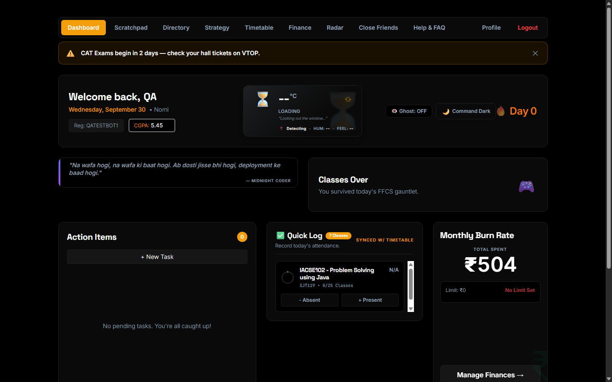
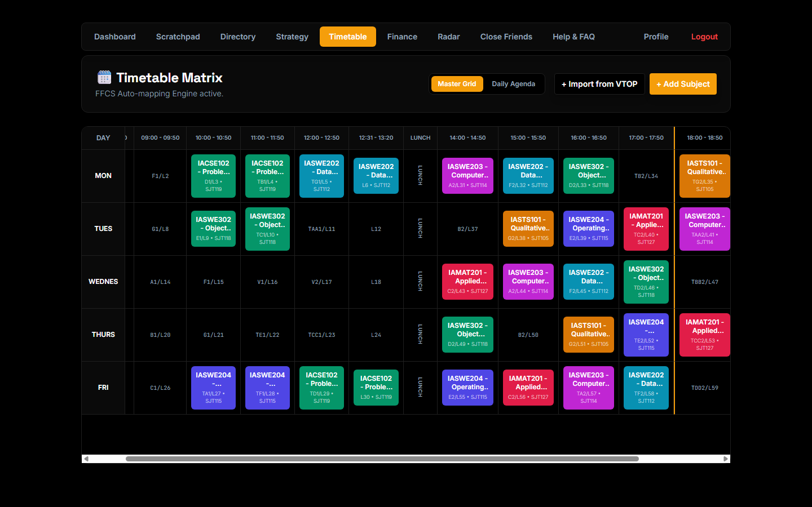
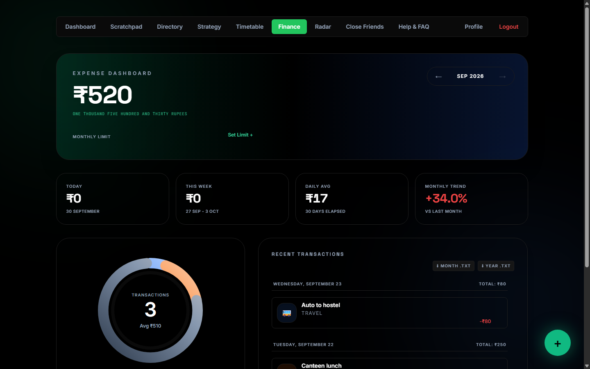
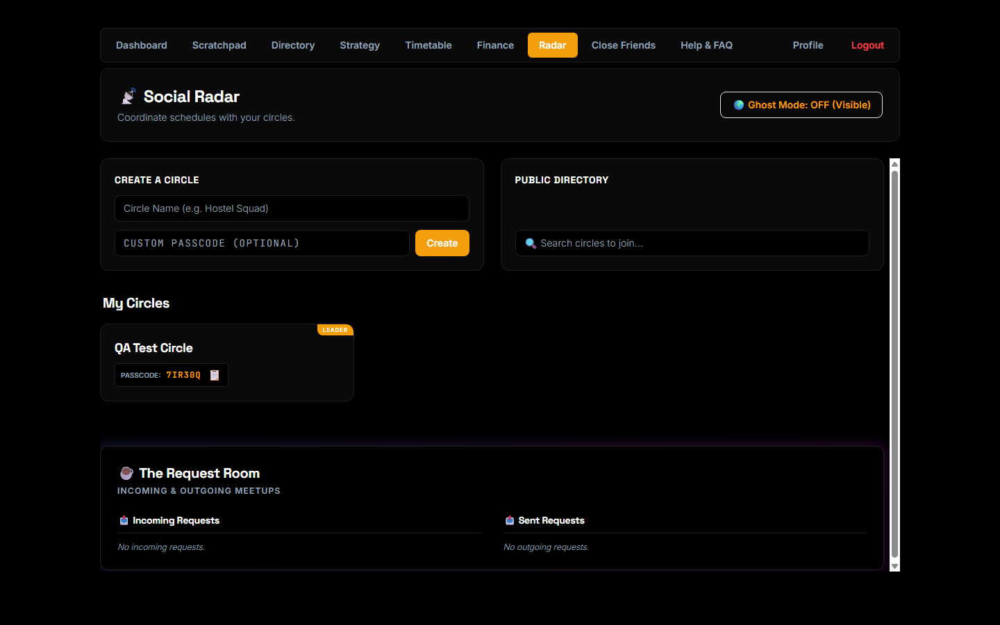
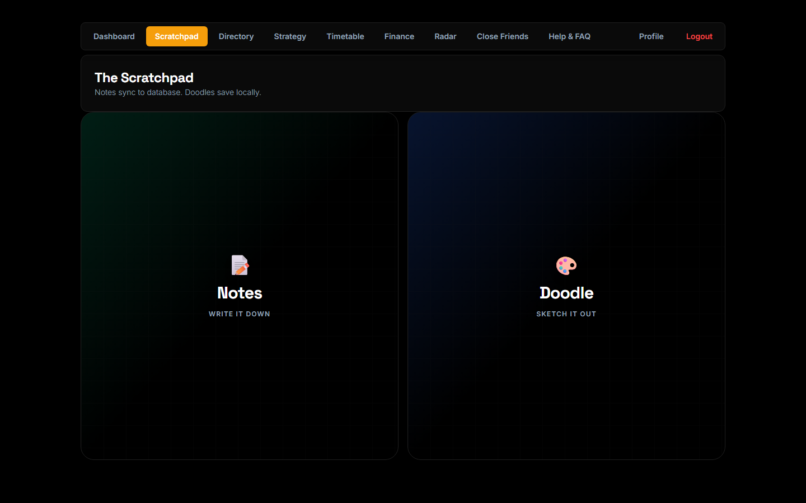
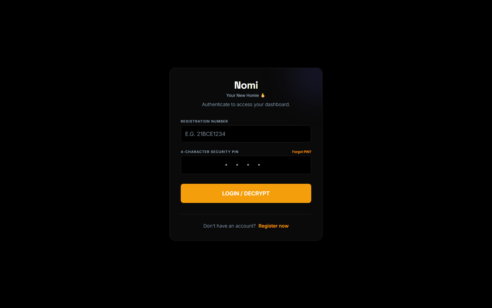
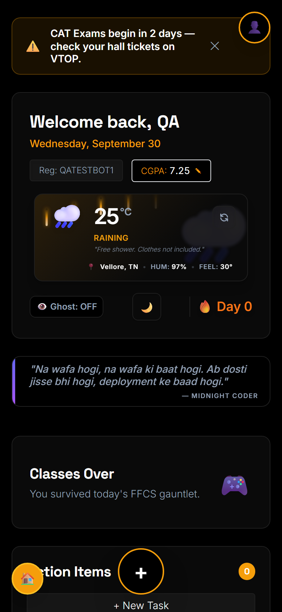
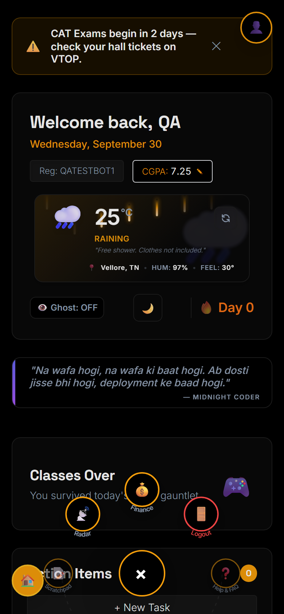
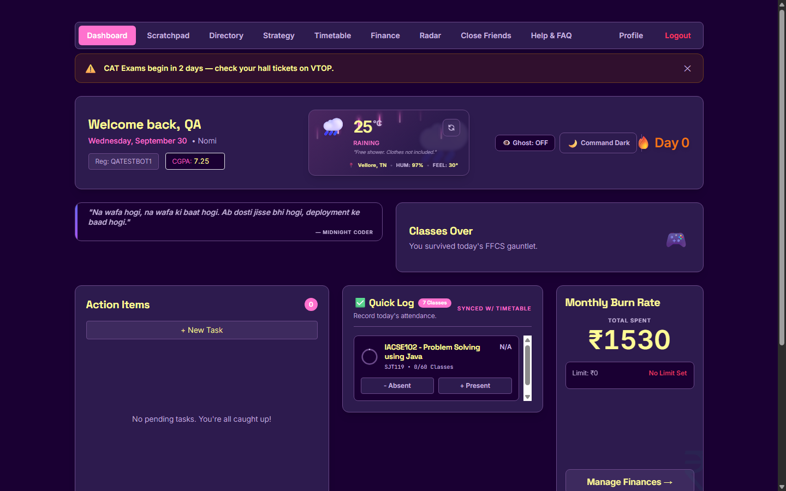
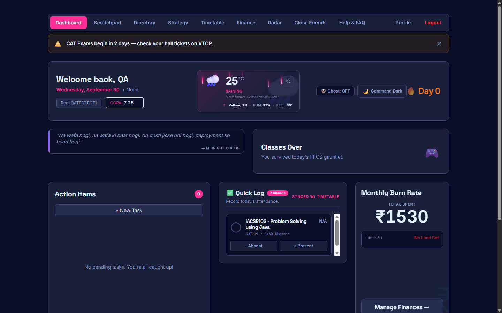

<div align="center">


# Nomi

**Your New Homie 🫰**

A mobile-first, installable Student OS — timetable, attendance, expenses, notes, and a live social layer for coordinating schedules with friends — built as a single-page PWA that also ships as a real Android app.

[](frontend/package.json)
[](frontend/package.json)
[](frontend/package.json)
[](backend/requirements.txt)
[](backend/database.py)
[](frontend/vite.config.js)

[Live App](https://nomi-navy-one.vercel.app) · [Report a Bug](https://github.com/Prakhar-Sethi012/student-dashboard-pwa/issues)

</div>

---

## What is this?

Nomi is a personal student dashboard that replaces a pile of separate apps — a timetable app, an attendance tracker, a budgeting app, a notes app, and a "who's free right now" group chat — with one installable PWA. It's mobile-first by design (a circular radial nav instead of a tab bar, drag-to-dismiss sheets, hold-to-confirm gestures, swipe-to-act rows) but works just as well as a desktop web app, and is wrapped as a Trusted Web Activity (TWA) via Bubblewrap for distribution on the Google Play Store.

It started as a FFCS (VIT's course registration system) timetable tool and grew into a full "student OS" — every feature below is something that was actually missing from the author's own daily student workflow.

## Screenshots

<table>
<tr>
<td width="50%"><p align="center"><em>Dashboard — next class, quick attendance log, tasks, burn rate</em></p></td>
<td width="50%"><p align="center"><em>Timetable Matrix — auto-mapped FFCS grid with clash detection</em></p></td>
</tr>
<tr>
<td width="50%"><p align="center"><em>Expenses — animated donut chart, budgets, .txt export</em></p></td>
<td width="50%"><p align="center"><em>Social Radar — circles, rosters, meetup requests</em></p></td>
</tr>
<tr>
<td width="50%"><p align="center"><em>Scratchpad — synced notes + a local doodle canvas</em></p></td>
<td width="50%"><p align="center"><em>Auth — PIN login, PIN recovery, optional biometric unlock</em></p></td>
</tr>
</table>

<div align="center">


<p><em>Mobile: the bottom tab bar is a radial dial instead — tap the FAB, drag or tap an icon</em></p>
</div>

<div align="center">


<p><em>Two of six switchable themes — Vaporwave and Cyberpunk (also: Command Dark, Paper Light, Brutalist, Nordic)</em></p>
</div>

## Features

### Dashboard
- Inline-editable CGPA, day-streak counter, live weather (Open-Meteo) with 105 rotating dev-humor quotes and a condition-matched animated overlay (rain streaks, drifting clouds, sunburst)
- **Next Class** widget — live Up Next / Currently In / Free Day / Classes Over, recalculated every minute
- **Quick Log** attendance — present/absent per subject with an animated ring, synced live with the Timetable
- Ghost Mode toggle, dismissible admin announcement banner, pull-to-refresh

### Timetable
- **Master Grid** (full week × slot table, auto-scrolled to now, clash detection on add) and **Daily Agenda** views
- One-paste **VTOP import** — copy your FFCS registration table and Nomi parses it into subjects, merging Theory+Lab into one Embedded course automatically
- Theory / Lab / Embedded slot types, PIN-gated delete

### Attendance Strategy Room
- A fully sandboxed bunk/attend simulator per subject ("safe bunk" and "rescue mission" forecasts) that never touches real data until reset

### Scratchpad
- Notes list ⇄ editor with a shared-element morph transition, debounced autosave
- A freehand **doodle canvas** (pointer + touch, DPR-aware, survives resizing into Fullscreen Focus Mode) with pen/marker/pencil textures, a collapsible color/size picker, and an eraser
- PIN-gated delete/wipe

### Social Radar
- **Circles** — create/join by passcode, leader-only destroy (hold-to-confirm), full audit log
- **Roster** — live free/busy + next-class per member, respects each member's Ghost Mode
- **Close Friends** — clone a friend's timetable into a locally-owned offline profile
- **Meetup Requests** — send/accept/decline, incoming/outgoing shown as collapsible stacks
- iOS-style push/pop navigation with edge-swipe-back between Lobby → Roster → Member Timetable

### Expenses
- Today / this-week / daily-average stat cards, month-over-month trend, animated SVG donut chart with category drill-down
- Per-month editable budget with over-budget warnings, swipe-to-delete rows, `.txt` export by month or year
- A floating "+" button that morphs directly into the new-transaction sheet via shared layout

### Directory & Profile
- Personal bookmark manager (Directory), copy-to-clipboard, PIN-gated delete
- **Auth**: PIN login/register, forgot-PIN recovery via a self-set security question, optional Face ID / Touch ID (WebAuthn) unlock
- **Profile**: PIN change (requires current PIN *or* security answer), and a **Danger Zone** — full account self-destruct gated behind hold-to-confirm *and* a second PIN check

### Everywhere
- **6 switchable themes** (Command Dark, Paper Light, Cyberpunk, Brutalist, Vaporwave, Nordic) via CSS variables
- A radial dial replaces the bottom tab bar on mobile — drag to rotate, tap to jump
- Drag-to-dismiss bottom sheets, hold-to-confirm for every irreversible action, iOS Mail-style swipe rows, haptic feedback throughout
- Installable PWA with an auto-updating service worker; failed requests while offline queue in IndexedDB and replay automatically on reconnect
- Every animation collapses to instant when the OS's "reduce motion" setting is on

## Tech Stack

**Frontend** — React 19 · Vite 8 · Tailwind CSS 3.4 · [Motion](https://motion.dev) (Framer Motion's successor) · `vite-plugin-pwa` · `localforage`. No router — a single `activeTab` state drives the whole app, with non-Dashboard routes code-split via `React.lazy`.

**Backend** — FastAPI · SQLAlchemy 2.0 · Pydantic v2 · PyJWT (bearer auth) · bcrypt · httpx. Postgres in production (Neon), with a portability layer that also runs it on SQLite.

**Deployment** — Frontend on Vercel, backend on Render, wrapped as an Android Trusted Web Activity via [Bubblewrap](https://github.com/GoogleChromeLabs/bubblewrap) for the Play Store.

## Getting Started

### Prerequisites
- Node.js 18+
- Python 3.11+
- A Postgres database (local, or a free one from [Neon](https://neon.tech))

### Backend

```bash
cd backend
python -m venv venv
venv\Scripts\activate          # or `source venv/bin/activate` on macOS/Linux
pip install -r requirements.txt
cp .env.example .env           # fill in DATABASE_URL and JWT_SECRET_KEY
uvicorn main:app --reload
```

Tables are created automatically on first run — no migration step needed for a fresh database.

### Frontend

```bash
cd frontend
npm install
npm run dev
```

The frontend talks to `http://localhost:8000` by default; only set `frontend/.env`'s `VITE_API_URL` if your backend lives somewhere else.

## Security

A few things worth calling out from an internal audit pass:
- Every mutating route across all 9 routers scopes its query to the authenticated user (or the correct ownership key, e.g. a Circle's `creator_id`) — no IDOR gaps found
- Rate limiting (sliding-window, per-account *and* per-IP) on `/login`, `/reset-pin`, and `/verify-pin`
- All PINs/passwords hashed with bcrypt; the legacy plaintext-PIN upgrade path uses constant-time comparison
- Every request schema enforces length bounds; `/docs`, `/redoc`, and the OpenAPI schema are only served outside production

---

<div align="center">

# Made With ♥️ By Prakhar Sethi

</div>
